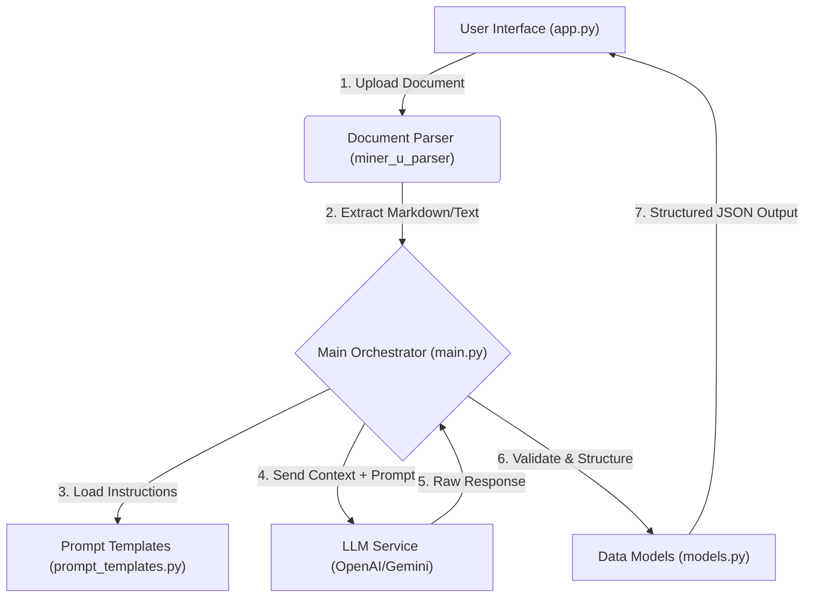

# Internship Assignment - Document Parser & LLM Processor

This repository contains a Python-based application designed to parse documents (likely PDFs), extract structured information using the `miner_u_parser`, and process the content using Large Language Models (LLMs) with custom prompt templates.

---

## 🚀 Features

* **Document Parsing:** Utilizes a custom integrated parser (`miner_u_parser`) to extract raw text and content from documents.
* **LLM Integration:** Uses `prompt_templates.py` to structure queries for an LLM to analyze or summarize extracted data.
* **Data Modeling:** Defines strict data structures in `models.py` to ensure consistent output formats.
* **Web Interface:** Includes an `app.py` for an interactive user experience.
* **Modular Design:** Separates parsing logic, data models, and prompt engineering for easier maintenance.

---

## 🏗️ High-Level Architecture

The application follows a linear processing pipeline designed to convert unstructured document data into structured, actionable insights.



### Pipeline Overview

* **Input:** The user uploads a file via the Web UI .
* **Parsing:** `miner_u_parser` processes the raw file (PDF/Doc) and converts it into clean, LLM-readable text or Markdown.
* **Orchestration:** `main.py` combines the parsed text with specific prompt instructions from `prompt_templates.py`.
* **Inference:** The combined context is sent to the LLM.
* **Validation:** The LLM's output is validated against strict Pydantic schemas defined in `models.py`.
* **Output:** The final structured data is presented to the user.

---

## 📂 Project Structure

```
Internship_Assignment/
├── miner_u_parser/      # Module handling document parsing logic (MinerU integration)
├── app.py               # Main entry point for the Web Interface (Streamlit)
├── main.py              # Core script for running the pipeline
├── models.py            # Pydantic models or data structures for the project
├── prompt_templates.py  # Collection of prompts used for LLM interactions
├── requirements.txt     # List of Python dependencies
└── .gitignore           # Git ignore file
```

---

## 🛠️ Installation

### Clone the Repository

```
git clone https://github.com/BEASTBOYJAY/Internship_Assignment.git
cd Internship_Assignment
```

### Create a Virtual Environment (Optional but Recommended)

```
python -m venv venv
# On Windows
venv\Scripts\activate
# On macOS/Linux
source venv/bin/activate
```

### Install Dependencies

```
pip install -r requirements.txt
```

---

## 🏃‍♂️ Usage

### Running the Web Interface

If `app.py` uses Streamlit:

```
streamlit run app.py
```

---

## 🧩 Components Breakdown

* **miner_u_parser:** Handles the ingestion of files (e.g., PDFs) and converts them into clean Markdown or text for the LLM.
* **models.py:** Defines strict data models using Pydantic to guarantee structured LLM output.
* **prompt_templates.py:** Contains the instructions and prompt engineering logic used to guide LLM behavior.
